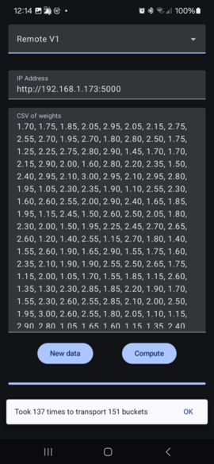

# Bucket accumulator demo



The goal of this project is to create a list of buckets, filled from 1 to 3. Then
calculate the smallest amount of trips to do, assuming a person can carry up tp 3.

3 implementations:

1. Local - a greedy implementation
2. Remote v1 - a greedy
3. Remote v2 - a less greedy implementation

## Algorytmic implementations

There is a less-greedy implementation on the server, which just tries
to fill up buckets, until it overflows. When it overflows, the 
new item will be pushed to a local queue. On next iteration, that
item will be added first to the current bucket.

The greedy implementation will just add values to the buckets.

They both produce the same results (a trip more or less). See further
on this document, to see how can this be improved.

The server and the Android code have a local implementation of
the less-greedy version. Should have the same results, unless I 
made an "oopsie".

## Android client

The Android client has a button to re-created random values
and a button to calculate the trips neeeded. You can chose to
use a local implementation, or a remote. If you choose a remote
server, you will need to pass the base URL of your server.

Code uses Jetpack compose for UI, and OkHttp3 for the networking.

The application is fixed to allow unencrypted networking, becasue
again, this is a demo - who cares about security ;-)

## Flask server

The remote server is written in Python3 (since its a toy demo, who 
really needs performance right?). There is a `requirements.txt`, 
I assume you know how to use it. On my setup I just `apt install python3-flask` instead.

The server has 3 entry points:

* `/init/`, `/init/v1`, `/init/v2` -  initialize the server
  to the corresponding API implementation (no version means v1)
* `/add_number/[]` (post) - adds a new number to be processed
* `/finalize/`, finishes the computation, returns a json similar 
  to this (2 trips, one contains a single bucket, the second 
  contains 2 buckets):

``` json
{
  "item_count": 3,
  "trips": [
    [2.5],
    [1.4,1.01]
  ]
}
```

To run the server, execute `buckets-server.py`. There is a test 
shell script to verify that the server runs, `test_server.sh`, which
does network calls using `curl`.

## Future expansions

1. The code has no unit tests.
1. An instrumentation to fill in the UI with pre-determinated values
   and choosing a local computation, then pressing the Compute
   button is nice. Then we can verify that the snakbar has the expected
   value.
1. No error checking at all (for example, if you choose server and
   its not up, the program will crash).
1. All API is syncrhoneous. If the calculations will take too much time
   network might stall. Instead the "init" should return an ID
   Adding new data shold also need an ID, and "finialize" will
   return a status "waiting" or "done" (again, an ID is needed).
1. DB persitance can be added, once an ID for a session is implemented.
1. The API assumes a streaming call (I don't send the whole list of 
   items), so this is something thats already been taken. However, the
   network calls to add a simple value are too slow. How about sending
   several items on each call?
1. The algorythm for clustering is not ideal. I genetic algorythm that
   runs (in o(k!) since all permutations need to be tested). Add all 
   items into a list, randomize the list, and separate the list by "3".
   Eventually - you will find an optimal list.
1. If we do this kind of algorythm, the client instead of polling, could
   be notified of a computation done. This can be done by MQTT directly
   or FCM.
1. A postman collection to properly test the server will be a good idea.
1. A nicer icon. I really was lazy and choose an ugly one.
